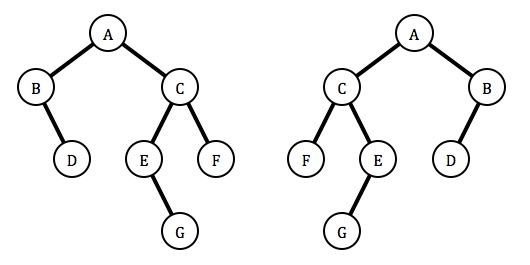

# PracticeProblems3

1) For the following tree, define the DFS pre-order, DFS in-order, DFS post-order, and BFS traversals of the following binary search tree. For all traversals, process child nodes left to right.

```text
    10
   / \
  3  12
 / \   \
1   7   13
         \
          15

```
```text
DFS Pre-order: 
DFS In-order: 
DFS Post-order: 
BFS:
```

2) A binary tree is modeled using the following class:

```java
public class BinaryTree<E> 
{
    protected BTNode<E> root;

    public void mirror() 
    {
        mirror(root);
    }
    
    private void mirror(BTNode<E> localRoot) {
        // you will complete this method
    }

    ...

    protected static class BTNode<E> {
        protected E data;
        protected BTNode<E> left;
        protected BTNode<E> right;

        ...
    }
}
```

Complete the method named mirror that alters the tree so that the final tree is a mirror image of the original tree. For example, if we use on this method on the tree shown on the left, we end up with the tree shown on the right. (NOTE: You will need a helper method here.)




3) For a Tree t, the lowest common connection for node 7 and node 13 will be node 10. Find the common connection of any 2 nodes or return -1 if there isn't one.

```text
    10
   / \
  3  12
 / \   \
1   7   13
         \
          15

```

```java
public static int sameAncestor(Tree t, int x, int y) 
{
    if (t == null) 
    {
        return 0;
    }
    //todo
}

```

4) Convert a max heap into a min-heap without recursion.

```java
public static ArrayList<Integer> convertMaxHeapToMinHeap(ArrayList<Integer> maxHeap) 
{ // Traverse the max heap from the last parent to the root
    for (int i = (maxHeap.size() / 2) - 1; i >= 0; i--) 
    {
        // Perform a top-down heapify starting from each parent
        int j = i;
        while (true) 
        {
                //todo
        }
    }
}
```


5) Write a program that gets all the nodes at a relative height.

```java
public List<Node> getNodesAtHeight(Node root, int height) 
{
    List<Node> nodes = new ArrayList<>();
    getNodesAtHeight(root, 0, height, nodes);
    return nodes;
}

private void getNodesAtHeight(Node node, int currentHeight, int targetHeight, List<Node> nodes) 
{
    //todo
}
```


6) The following code should check if a given binary tree is a BST. However, for some trees, it
returns the wrong answer.

```java
public static boolean brokenIsBST(TreeNode T) 
{
    if (T == null) 
    {
        return true;
    } 
    else if (T.left != null && T.left.val > T.val ||
    T.right != null && T.right.val < T.val) 
    {
        return false;
    } 
    else 
    {
        return brokenIsBST(T.left) && brokenIsBST(T.right);
    }
}
```

a) Give an example of a binary tree for which brokenIsBST fails.

b) Now, write isBST that fixes the error encountered in part a)

Hint: You will find Integer.MIN_VALUE and Integer.MAX_VALUE is helpful.

```java
public static boolean isBST(TreeNode T) 
{
     return isBSTHelper(T, Integer.MIN_VALUE, Integer.MAX_VALUE);
}

public static boolean isBSTHelper(TreeNode T, int min, int max) 
{
    //todo
}
```

7) Given a heap represented as an ArrayList, determine if it is a valid min-heap. Use a for loop.

```java
public static boolean isMinHeap(ArrayList<Integer> minHeap) 
{
    
   // todo
    
}
```
